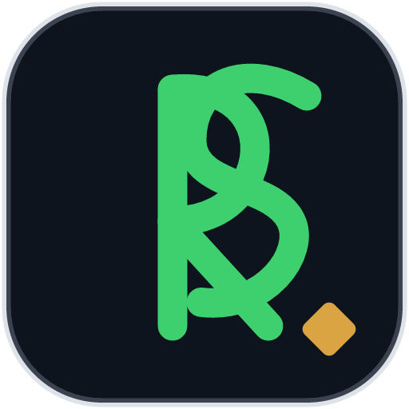

# RS — Brand System

The official brand identity of Rowan Sampson — Digital Origin. Open-sourced
as an artifact: the mark, the tokens, and the rules behind it.

  

## The Register Mark

The mark is a woven **RS monogram** inside the register chip — the rounded
tile used across the product UI — with a single gold **register point**
(bottom-right) marking the point of record.

Three versions ship:

| File | Use |
|---|---|
| `rowan-rs-mark.svg` | Primary — dark tile, green monogram, gold point |
| `rowan-rs-mark-duotone.svg` | Alternate — green R, gold S |
| `rowan-rs-mark-light.svg` | Light variant for print and letterhead |
| `rowan-sampson-lockup.svg` | Full lockup — mark, wordmark, product line |
| `favicon.svg` | Browser icon |

## Design tokens

| Token | Value | Role |
|---|---|---|
| `--bg` | `#0a0e14` | Page background |
| `--surface` | `#0e141d` | Chip fill |
| `--text` | `#eaeff6` | Primary text |
| `--muted` | `#94a2b4` | Secondary text |
| `--green` | `#3ecf6e` | Signal — engineering, live status |
| `--gold` | `#d9a441` | Register point — executive, record |
| Serif | Georgia / Iowan | Editorial voice |
| Mono | ui-monospace / Menlo | Technical voice |

## Usage rules

1. The mark never stretches — always scale proportionally.
2. Minimum clear space equals the height of the gold point.
3. On dark surfaces use the primary; on light surfaces use the light variant.
4. The green never changes — it is the live-status colour of the brand.

## License

MIT — the system is open. Attribution appreciated: "Mark © Rowan Sampson —
Digital Origin".
